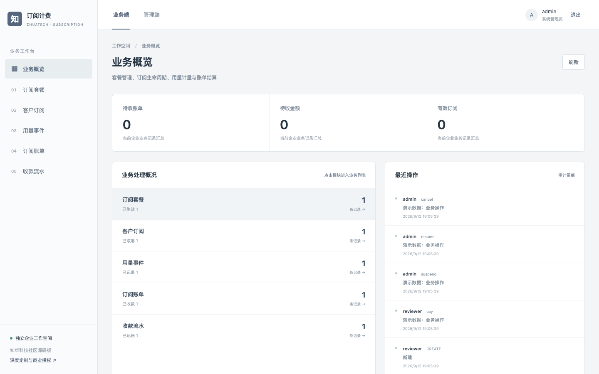
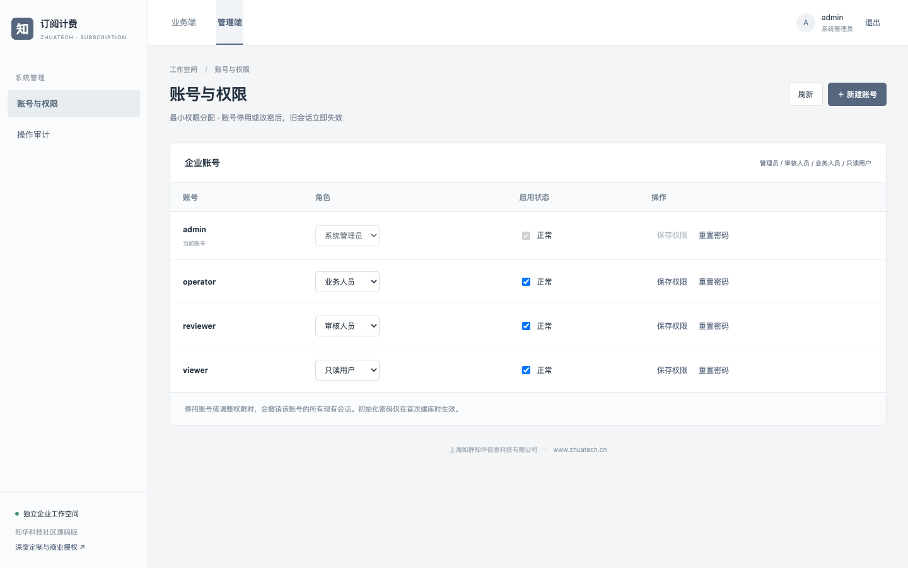
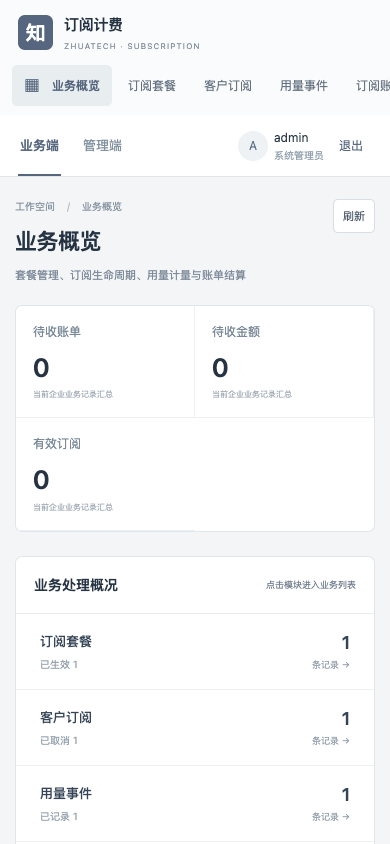

# zhuatech-subscription · 知华订阅计费

上海如静知华信息科技有限公司提供的订阅业务系统源码，覆盖从套餐定价到收款核销的完整内部流程。[了解知华科技](https://www.zhuatech.cn/)。

## 用一张账单理解系统

套餐「每席位月费 20 元、每席位包含 100 用量、超额单价 0.5 元」，客户开通 2 席位并在账期使用 250 单位，出账得到：

```text
基础费用 20 × 2 = 40.00
超额用量 250 - 100 × 2 = 50
超额费用 50 × 0.5 = 25.00
账单应收 = 65.00
```

这不是静态示例：同一计算和账期重叠拒绝、用量事件去重、已出账期间禁止补记，都在后端业务动作与自动化测试中执行。

## 业务工作区

- 套餐：编码去重；套餐产生订阅后不可改写历史价格。
- 订阅：起草、独立审批开通、暂停、恢复、取消；管理员按账期生成账单。
- 用量：关联有效订阅，按事件 ID 去重，按账期归集。
- 账单与收款：生成费用明细、应收金额；独立审核角色核销并保留唯一收款流水号。
- 企业管理：账号/角色管理、审计、附件、CSV、租户隔离、并发版本和幂等请求。



管理端账号与权限设置：



移动 H5 工作台：



**对接边界：**已实现内部计费与收款登记，但不替代支付网关、税务开票平台或会计总账。正式收费需完成这些系统的对账接口和财务验收。

## 运行与验证

需要 Docker Compose。复制 `.env.example` 为 `.env`，分别设置 MySQL 与四种角色的独立强密码，然后执行：

```bash
docker compose up -d --build
sh scripts/test.sh
```

业务端与管理端共用 `http://127.0.0.1:8088`（管理入口 `/admin`）；后端健康检查为 `http://127.0.0.1:18080/api/health`。四个初始化账号为 `admin`、`reviewer`、`operator`、`viewer`，密码从环境变量读取。端口可通过 `WEB_PORT`、`API_PORT` 调整。可使用 `.env.demo.example` 做**仅本机**演示，但切勿连接真实业务数据库或向公网开放演示密码。

后端采用 Java 21 / Spring Boot 4 / MySQL 8.4 / Flyway；前端采用 Vue 3 / Vite，适配桌面与 H5。CI 在 MySQL 上运行后端测试；本机脚本默认用 H2 MySQL 兼容模式跑后端验收，再跑前端单测及生产构建。完整验收脚本见 `backend/src/test/resources/acceptance.json`。

## 使用边界与授权

本仓库是可运行的公开源码学习交流版本，**不是 OSI 意义的开源许可**。根据 [LICENSE](LICENSE)，源码仅限个人非商业学习、研究和交流。企业内部生产、客户交付、SaaS、收费服务及其他商用均须先取得上海如静知华信息科技有限公司书面授权。生产上线还需要企业自己的安全评估、备份恢复、合规与业务参数验收。

[知华科技官网](https://www.zhuatech.cn/)提供中小企业信息化、AI 转型、OPC 技术支持、软件项目外包、实施、FDE 外包与深度开发定制咨询。也可扫码添加微信咨询：

| 微信咨询一 | 微信咨询二 |
| --- | --- |
|  |  |

版权及项目维护：上海如静知华信息科技有限公司 · https://www.zhuatech.cn/
